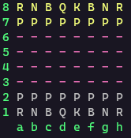
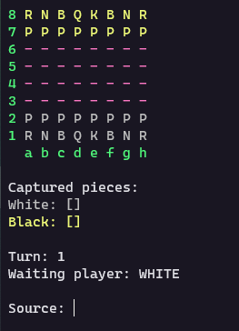
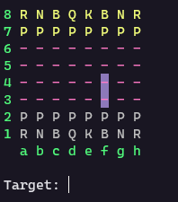
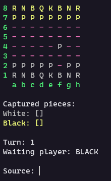

# Sistema de Xadrez

Jogo de Xadrez feito no curso de Java  do Nélio Alves na Udemy.

O jogo é Jogado pelo Terminal.

## Pré-requisitos

1. Java
1. IDE Intellij ou Eclipse
1. Terminal com cores (opcional)

## Iniciando a aplicação

Compilando o projeto

- `javac -d out/production -sourcepath src .\src\application\Program.java`

Iniciando o projeto

- `cd out/production`
- `java application/Program`

## O jogo

### Peças

As peças são representas por letras, sendo:

- R -> Rook -> Torre
- N -> Knight -> Cavalo
- B -> Bishop -> Bispo
- Q -> Queen -> Rainha
- K -> King -> Rei
- P -> Pawn -> Peão

### Como jogar

O jogo é em turnos començando pelas peças brancas e depois as pretas (representas em amarelo).

Para fazer uma jogada é necessário informar a localização da peça que será usada (Source) passando coluna e linha respectivamente, por exemplo `f2`, e em seguida aparerá quais as possiveis jogadas daquela peça.

Ao informar para onde a peça irá se mover (Target) ela realizará o movimento, se possivel, e irá ser a vez do proximo jogador.

